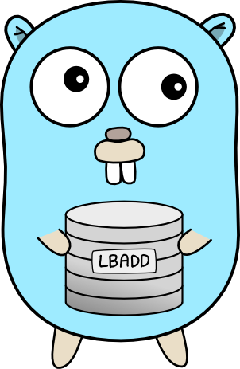

    </img>
    <h1 align="center">LBADD</h1>
    
Let's build a distributed database.

    

        
        
        
         
        
    

---

LBADD is an experimental distributed SQL database, written in Go.

The goal of this project is to build a database from scratch which is well documented, fully tested, and easy to understand. Implementing as much as possible from the ground up.

It is also currently a work in progress. Feel free to follow along with the development of each component, from parser to pager.

## Architecture

The database is made up of a few separate components. These handle the **SQL parsing**, the **intermediary representation generation**, the **multi-node consensus**, the **execution of the IR**, and the (persistent) **storage**.

For a brief overview of the purpose of each component, have a look at the [overview](./doc/overview.md).

### Prior art
Inspiration has been taken from the brilliantly documented codebase of [SQLite](https://github.com/sqlite/sqlite). However the codebase has been heavily optimized, and is difficult to follow without spending significant time.

Work has also already been done to build a distributed version of SQLite called [rqlite](https://github.com/rqlite/rqlite). The project uses [raft](https://github.com/hashicorp/raft) consensus in order to keep nodes consistent across the network.

LBADD aims to replicate these in a single project. LBADD doesn't aim to be nearly as performant as SQLite nor rqlite, and hopefully trades this instead for slightly more clarity and simplicity.

## Contributing
Contributors are more than welcome and much appreciated. Please feel free to open a PR to improve anything you don't like, or would like to add. No PR is too small! Go check out our [contributing guide](./CONTRIBUTING.md) for more detailed info about how to get started with a contribution.

## License
This project is licensed under the MIT license.

