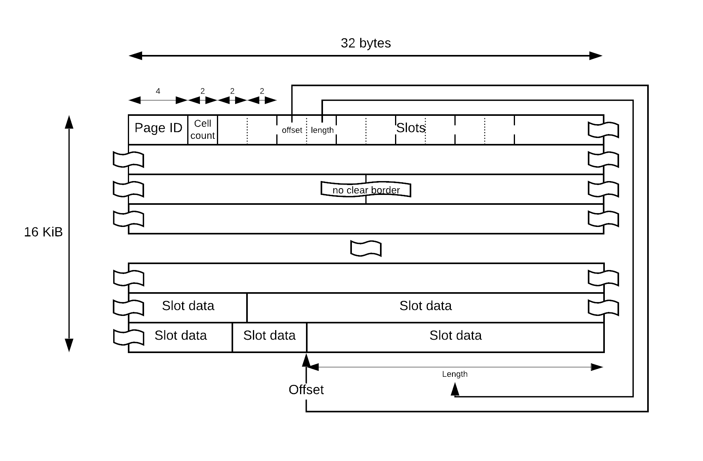
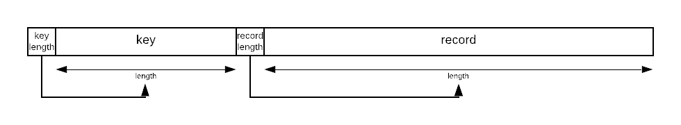

# Page layout
This document describes the layout and format of a single memory page. All pages
are structured like this.

**Please note:** "2 bytes indicating a length" implies, that these two bytes,
interpreted as **big endian** encoded **unsigned two byte integer** indicate
said length. In other words, whenever we talk about bytes forming some kind of
number, it is always the big endian encoding of an integer, either 2, 4 or 8
bytes.

## Page format
Pages implement the concept of slotted pages. A helpful resource for
understanding is
[this](https://db.in.tum.de/teaching/ss17/moderndbs/chapter3.pdf#page=8) PDF.
Please note though, that we do not follow the exact data structure that is
proposed in that file.

The above image describes the layout of a page. A page has a **fixed size of
16KiB** (16384 byte).

The **first 6 bytes** are the page header. It has a fixed size and will always
have that 6 byte layout. The **first 4 bytes** represent the page ID. This is
globally unique and is set upon page allocation. A page cannot infer it's own ID
without that header field. The **next 2 bytes** represent the cell count in this
page. This is the amount of slots that occur after the header, and is updated
with every call to `storeCell`.

After the header, in **4 byte chunks**, slots are defined. A slot points to an
absolute offset within the page, and holds a size attribute. The **first 2
bytes** are the offset, the **second 2 bytes** are the size.

Between slots and data, there is free space. This is the space, where new cells
(slots on the left, and data on the right) will be inserted. Slots are always
**sorted by the key of the cell that they point to**.

A single "slot data" is a full cell, as described [below](#cell-format).

## Cell format
Cells are simple key-value entities.

The above image describes the layout of a cell. A cell contains of a single key
and a single value, which is called the record. Both in front of the key and in
front of the record, there are **2 bytes** indicating the length of the key
respectively the record.